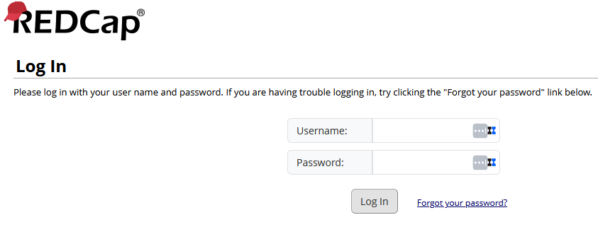

# L'account

Gli account sono strettamente personali e identificati da uno **username** scelto dall’amministratore (solitamente nel formato `nome.cognome`). Solo l'amministratore del sistema può creare nuovi account all'interno della piattaforma.

## Sicurezza
- Gli account sono protetti da **password** (non nota all’amministratore).  La validità della passowrd è di 90 giorni.
- È attiva un’**autenticazione a due fattori**: in fase di login, oltre alla password, viene richiesto un token numerico temporaneo, inviato via email o generato tramite l’app *Microsoft Authenticator*. <a href="https://support.microsoft.com/it-it/account-billing/come-aggiungere-gli-account-a-microsoft-authenticator-92544b53-7706-4581-a142-30344a2a2a57" target="_blank"> Qui è presente una guida</a> per impostare Authenticator sul proprio cellulare.
- Gli account che non effettuano accessi per un lungo periodo di tempo, vengono automaticamente sospesi.
- Tutti gli account vengono sospesi automaticamente dopo 1 anno dalla creazione. La durata dell'account può essere prorogata dall'amministratore, a seconda delle necessità del progetto.

### Reset della password

La richiesta di reset della password può essere fatta in autonomia dalla pagina principale di **REDCap SIGG**, cliccando su *Forgot your password?*

  

## Funzionalità del PI (Principal Investigator)

All’interno di ciascun PID, l’account del PI può gestire:  
- Il disegno dei form di raccolta dati.
- Lo stato del progetto (sviluppo, produzione, archiviazione)  
- Gli account dei collaboratori.  
- Il download o la visualizzazione dei dati caricati.

# Account e privilegi

Gli account sono strettamente personali e identificati da uno **username** scelto dall’amministratore (solitamente nel formato `nome.cognome`).  

### Sicurezza
- Gli account sono protetti da **password** (non nota all’amministratore).  La validità della passowrd è di 90 giorni.
- È attiva un’**autenticazione a due fattori**: in fase di login, oltre alla password, viene richiesto un token numerico temporaneo, inviato via email o generato tramite l’app *Microsoft Authenticator*.
- Gli account che non effettuano accessi per un lungo periodo di tempo, vengono automaticamente sospesi.
- Tutti gli account vengono sospesi automaticamente dopo 1 anno dalla creazione. La durata dell'account può essere prorogata dall'amministratore, a seconda delle necessità del progetto.

---

## Creazione degli account

- Gli account vengono creati dall’amministratore della piattaforma REDCap SIGG.  
- L’account del **PI**, con pieni privilegi sul progetto, viene creato contemporaneamente all’attivazione del progetto.  
- Gli account dei **collaboratori** (ad esempio *data collector*, *manager*, *designer*) vengono creati solo dopo richiesta formale via email da parte del PI.  

Nella fase iniziale, solo l’account del PI ha accesso al progetto. I collaboratori vengono **associati** al PI tramite una **sponsorizzazione**, che consente al PI di:  
- Includere gli account collaboratori nel progetto.  
- Definirne due caratteristiche fondamentali:  
  - **I privilegi**.  
  - **La partecipazione ai Data Access Groups (DAG)**.
