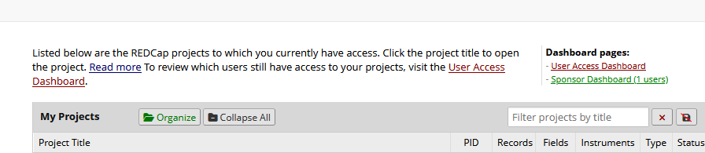
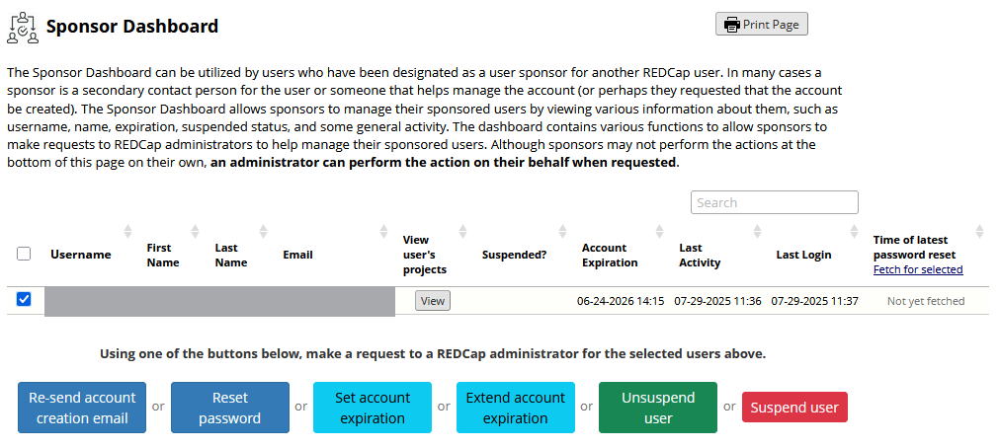
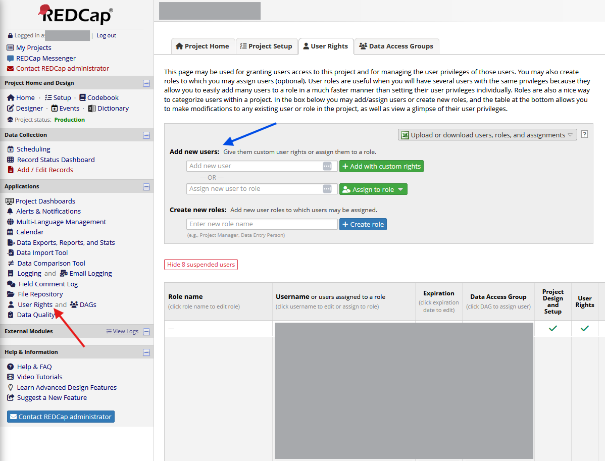

# L'account
Gli account sono strettamente personali e identificati da uno **username** scelto dall’amministratore (solitamente nel formato `nome.cognome`). Solo l'amministratore del sistema può creare nuovi account all'interno della piattaforma. Tutte le azioni svolte all'interno di un progetto sono automaticamente registrate da REDCap SIGG (in ottemperanza con la vigente normativa) e associate al relativo account. E' fortemente sconsigliato cedere le proprie credenziali ad altre persone.

## Sicurezza
- Gli account sono protetti da **password** (non nota all’amministratore).  La validità della passowrd è di 90 giorni.
- È attiva un’*autenticazione a due fattori*.
  
La durata di ogni password è di 90 giorni, oltre i quali verrà richiesto all'utente di modificarla. L'autenticazione a due fattori assicura maggiore sicurezza nell'accesso alla piattaforma: questa forma di autenticazione avviene tramite l'inserimento di un codice temporaneo numerico. L'utente potrà scegliere, ad ogni login, se ricevere il codice temporaneo sull'email utilizzata in fase di iscrizione o se ottenere il codice tramite tramite l’app *Microsoft Authenticator*. <a href="https://support.microsoft.com/it-it/account-billing/come-aggiungere-gli-account-a-microsoft-authenticator-92544b53-7706-4581-a142-30344a2a2a57" target="_blank"> Qui </a> è disponibile una guida per impostare Authenticator sul proprio cellulare. Sulla piattaforma sono state istituite delle politiche di sospensione automatica dell'account: tutti gli account hanno una durata pre-impostata di un anno dalla loro creazione, ma possono essere sospesi prima in caso non venga effettuato il login per un lungo periodo di tempo. La piattaforma invia un'email per avvisare della sospensione dell'account e, attraverso il contatto con l'amministratore della piattaforma per il PI o tramite il PI per gli account dei collaboratori (vedi sotto), tutti gli account possono essere ri-attivati (mantenendo i diritti di accesso e i privilegi associati prima della sospensione).

### Reset della password
La richiesta di reset della password può essere fatta in autonomia dalla pagina principale di **REDCap SIGG**, cliccando su *Forgot your password?*. L'amministratore non ha la possibilità di conoscere o inviare la password all'utente.

  

## Creazione degli account  
- L’account del **PI**, con pieni privilegi sul progetto, viene creato contemporaneamente all’attivazione del progetto.  
- Gli account dei **collaboratori** (ad esempio *data collector*, *manager*, *designer*) vengono creati solo dopo richiesta formale via email da parte del PI.

Nel caso fosse necessario ottenere numerosi account per i propri collaboratori, l'amministratore della piattaforma potrebbe richiedere la compilazione dei un form che semplifichi il caricamento e il tracciamento dell'operazione (disponibile [qui](https://raw.githubusercontent.com/gruppoYES/REDCapSIGG/refs/heads/main/files/UserImportTemplate.csv" download).

### Gli account dei collaboratori (sponsorizzazione)
Tutti gli account per i collaboratori saranno associati a quello del PI stesso, il quale assumerà per questi il ruolo di *sponsor*. La sponsorizzazione permette al PI di gestire in autonomia gli account dei suoi collaboratori. Il PI potrà gestire gli account sponsorizzati dalla pagina principale di REDCap SIGG, dopo aver effetuato il login, cliccando su *Sponsor Dashboard* (in verde nell'immagine sotto).

  

Dalla *Sponsor Dashboard*, il PI potrà richiedere reset della password, estensioni del periodo di validità dell'account, ri-attivazione o sospensione degli account.

  

Il PI potrà includere nel proprio progetto l'account di un collaboratore tramite la pagina dedicata, all'interno del progetto stesso. Dalla pagina iniziale del progetto, è necessario cliccare su *User Rights* (freccia rossa), quindi inserire lo *username* del collaboratore sotto a *Add new users* (freccia blu).

  

Nella fase iniziale, solo l’account del PI ha accesso al progetto. I collaboratori vengono **associati** al PI tramite una **sponsorizzazione**, che consente al PI di:  
- Includere gli account collaboratori nel progetto.  
- Definirne due caratteristiche fondamentali:  
  - **I privilegi**.  
  - **La partecipazione ai Data Access Groups (DAG)**.
